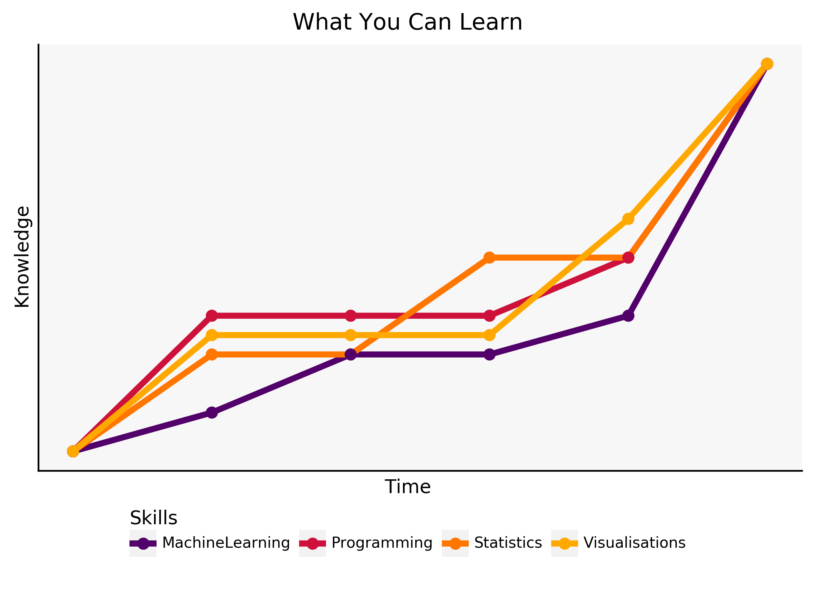
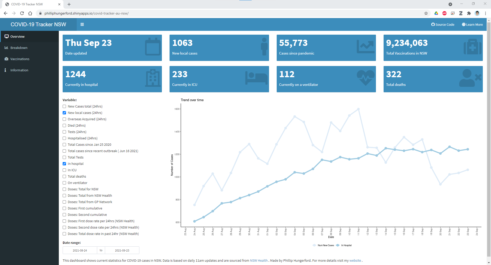

# Welcome!

This site is all about health related data and how we can best analyse it using a range of data science tools. These include statistical analysis, visualisation tools and machine learning.




# News
2021-09-26

I have created a productivity section with a project template guide. This is the best way to plan your project! Check it out [here](productivity-project-create.md). 


2021-08-17

I have created a dashboard that shows the NSW Health data regarding COVID cases in NSW. Dashboard is hosted on the shiny apps server [here](https://philliphungerford.shinyapps.io/covid-tracker-au-nsw/).




# Subjects

> - Tutorials
>   - Programming
>   	- [Data Manipulation (SQL, Python, R)](tutorials-programming-01.md)
>   - Statistics
>     - [Fundamentals](statistics-fundamentals.md)
>       - Frequency distributions and graphing
>       - Rankings in a distribution
>       - Central tendency
>       - Variability
>       - Standard scores
>       - Estimation and sampling distributions
>       - Probability
>       - Binomial probability
>       - Hypothesis testing
>       - One sample t-test
>       - Bivariate designs
>       - Independent groups t-test
>       - Paired samples t-test
>       - Correlation
>       - Regression
>       - Analysis of variance (ANOVA)
>       - Chi-square 
>       - Power analysis
>       - Linear Models
>       - Generalised Linear Models
>     - Longitudinal Data Analysis
>       - Longitudinal data
>       - Linear Mixed Effects Models
>       - Generalised Estimating Equations
>       - Generalised Linear Mixed Effects Models
>       - Multilevel Modelling
>       - Missing Data and Dropout
>       - [Time-To-Event (Survival) Analysis](statistics-lda-survival.md)
>     - Machine Learning
>       - Supervised
>         - Classification and Regression
>         - Generalisation, overfitting and underfitting
>         - K-Nearest Neighbours (KNN)
>         - Linear Models
>         - Naive Bayes Classifiers
>         - Decision Trees
>         - Ensembles of Decision Trees
>         - Kernelised Support Vector Machines (SVM)
>         - Neural Networks (Deep Learning)
>       - Unsupervised
>         - Dimensionality Reduction, Feature Extraction and Manifold Learning
>         - Principal Component Analysis (PCA)
>         - Non-Negative Matrix Factorisation (NMF)
>         - Manifold Learning with t-SNE
>         - Clustering
>           - K-Means Clustering
>           - Agglomerative Clustering
>           - DBSCAN
>           - Comparing Clustering Algorithms
>       - Model Evaluation and Improvement
> - Data science projects
>   - [Identifying 3D organ scans using AI](https://github.com/philliphungerford/dissertation)
>   - [Predicting prostate cancer plan violations using AI](https://github.com/philliphungerford/dissertation)
>   - [Visualising longitudinal study data in R](https://github.com/philliphungerford/ndarc-point-dashboard)
>   - [COVID-19 Tracker NSW](https://philliphungerford.shinyapps.io/covid-tracker-au-nsw/)
> - Productivity
>   - [The best way to plan a project](productivity-project-create.md)


# About Me

If you would like to know more about me, click [here](about.md).


```
“Data is a precious thing and will last longer than the systems themselves.” - Tim Berners-Lee
```

