# PROJECT TEMPLATE

# Introduction

This is the best way to plan a project and get it done. The planning phase is critical to get the ball rolling and have the project complete itself. 

# Project Structure

There are two key components to projects:

1. Tasks
2. Time

These two work hand in hand. In order to complete a task, you need time. Therefore time in the real world needs to be considered when planning your project. If you plan a project with all of the right tasks and no time to do them, then it won't get done. With this in mind, your projects have a FOUR layers:

1. PROJECT (the accumulation of completed tasks that took time to complete)
    1. GROUPS  (headings in things) 
        1. SECTIONS (to-dos)
            1. TASKS (broken down into 25min pomodoro chunks)

To reiterate, the accumulation of subtasks make up your tasks, and your tasks make up your sections. When all sections are completed, your project is complete!

**Figure 1. - Project Make up**

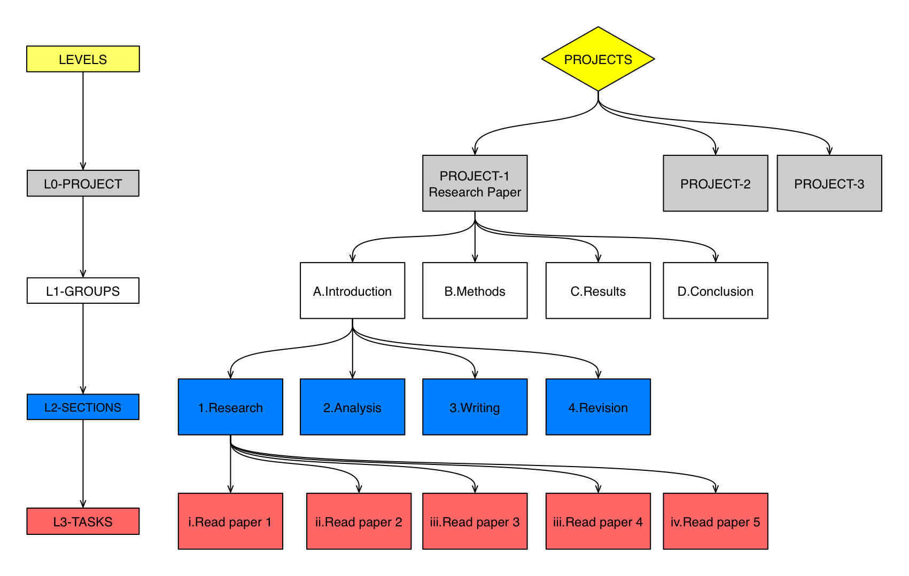

# STEPS

## STEP 1:  GROUPS

You need to find out what groups makes up your project. List them. For our research paper example:

1. Introduction
2. Methods
3. Results
4. Conclusion

Try to make sure your GROUPS have an ordered structure, by completing one at a time. This can make scheduling GROUPS a lot easier and you get the satisfaction of completing a GROUP at a time ( = more dopamine!). 

## STEP 2: WHAT SECTIONS ARE THESE GROUPS MADE UP OF?

1. Introduction
    1. Research
    2. Analysis
    3. Writing
    4. Revision
2. Methods
3. Results
4. Conclusion

## STEP 3: TASKS

Now we are getting into the nitty gritty. How can you breakdown each SECTION into 25 min chunks? The key here is to be 100% certain you can do it in 25 mins. If it takes you an hour to read a paper, that's fine, turn that into two tasks. 

1. Introduction
    1. Research
        1. Read paper 1
        2. Read paper 2
        3. Read paper 3
        4. Read paper 4
        5. Read paper 5
    2. Analysis
    3. Writing
    4. Revision
2. Methods
3. Results
4. Conclusion

IMPORTANT! Make sure you can do a task within 25 minutes. If you cannot, break it down further (e.g. Read 50% of paper 1). This way you are also time managing and have achievable goals. 

## STEP 4: MAKE THEM TIME RELATIVE:

1. View in table view and add a date column with todays date for all.
2. Then create a calendar view
3. Turn on properties → view (group, section, complete)
4. Starting with GROUP 1 SECTION 1, distribute your tasks to how many you can complete on a day for the week.
5. MAKE SURE EACH TASK IS ON A DAY SO YOU DO IT

## STEP 5: Grab a drink and celebrate.

The hardest part of your project is now done. You can relax because you know the exact steps to take all broken down into nice bite size 30 min chunks. If something happens, you can shift a card forward or backward. Its super easy. 

Try and distribute your tasks into as simple stress free easy looking day as possible in your given window. The less stressful it looks, the less likely you are to want to procrastinate on it. The more likely you are to complete one task, the more likely you would want to complete another (e.g. I have all of Monday to read one paper? Easy peasy!). 

Now you can keep a separate task list for every project, or you can have a master task list with all of your projects, and create a linked one within a new project and just filter by PROJECT. This would allow you to see all of your tasks together and manage your time a lot better. 

# Working with other People & Meetings/Events

Additionally you may be working working with other people on the this project. With Notion, you can assign a task to a person to manage who is doing what task. This means that there are most likely going to be **meetings** with these people. If this is the case, your projects are now made up of three things. 

1. Tasks
2. Time
3. Meetings

Your Tasks and Meetings will be scheduled according to Time. It is also important to document these things in your **notes**. 

# Setup

Create a flowchart of your project so you understand how it is structured.

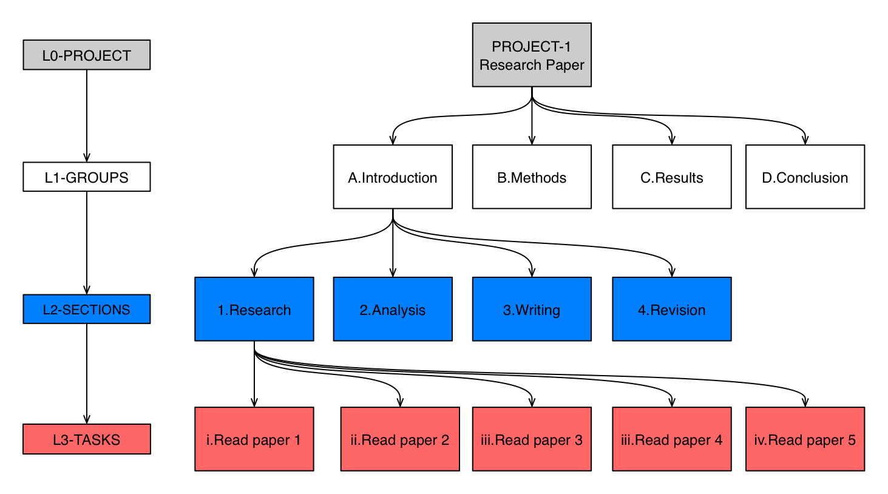

## Trello

For each list you have a card for each level 1 item. As you can see for L1-Introduction, there are 8 tasks that need to be done. This represents 8 pomodoro chunks = 4hrs of work left. 

The other option is to have each card represent a task. Your level 1 items are now lists, level 2 items are tags and level 3 items are cards. This way you can assign a date to each card and when you complete them you tick the completed button. This also allows you to assign cards to people, and keep notes within each of your tasks. For example with Read paper 1, you can put your notes and attach the paper in that specific card.

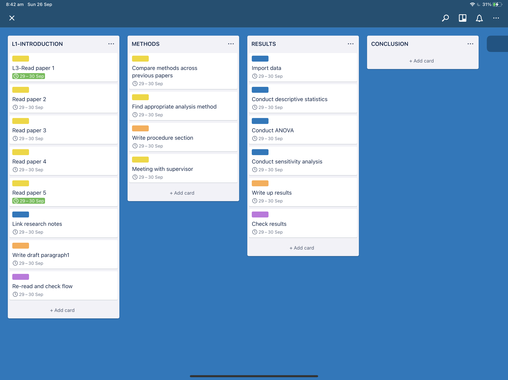

You can see the level 2 items below. You may not find level 2 labels useful in Trello, and that is understandable. However identifying your level 2 items are important in your flowchart setup. 

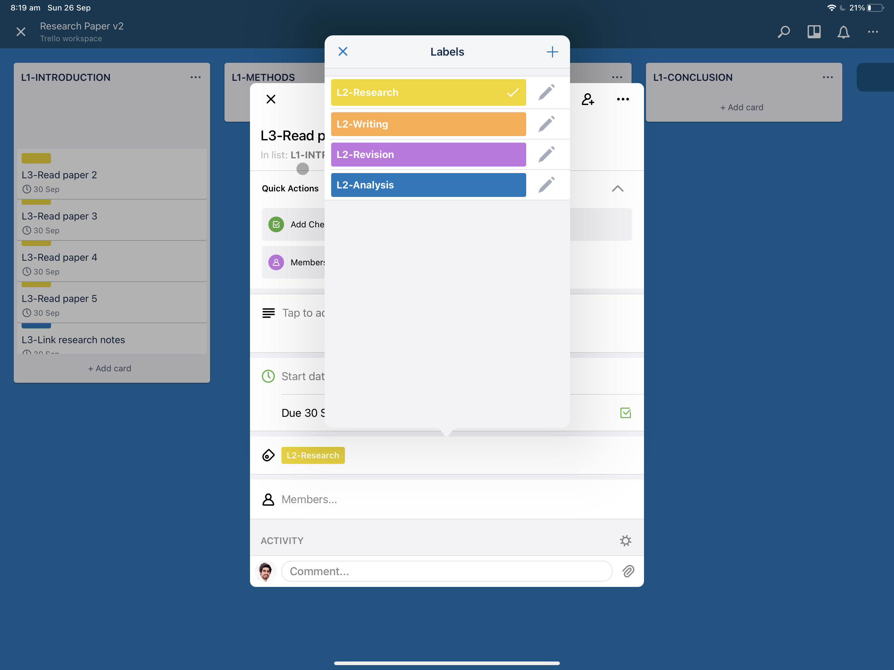

## Notion

The process with notion is a bit more complex than Trello but also enables you to customise it to your liking. 

Here we put this structure into a nice table and we will call it TASKS. It will have all of our tasks and can be filtered by its respective section, group and project. 

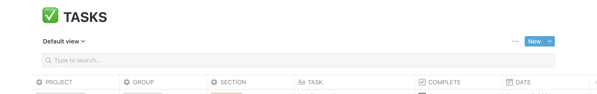

**Groups**

Create a board view for your tasks. This view will look great, trust me! Click on ‘Default view’ and make a board view. This way you can see your groups in a visual format. Remember that this is still your TASKS table just visualised differently. 

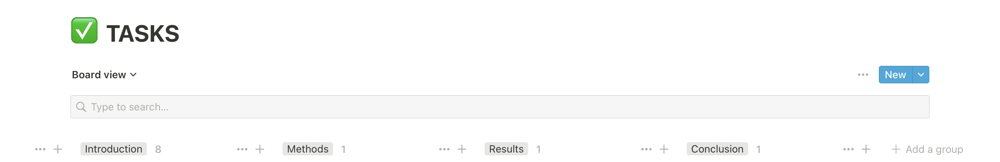

**Sections**

After you add your sections this is what your board will look like. Click on the three dots on the right next to the ‘New’ button. Go into properties and make sure you can view your sections under visible properties.

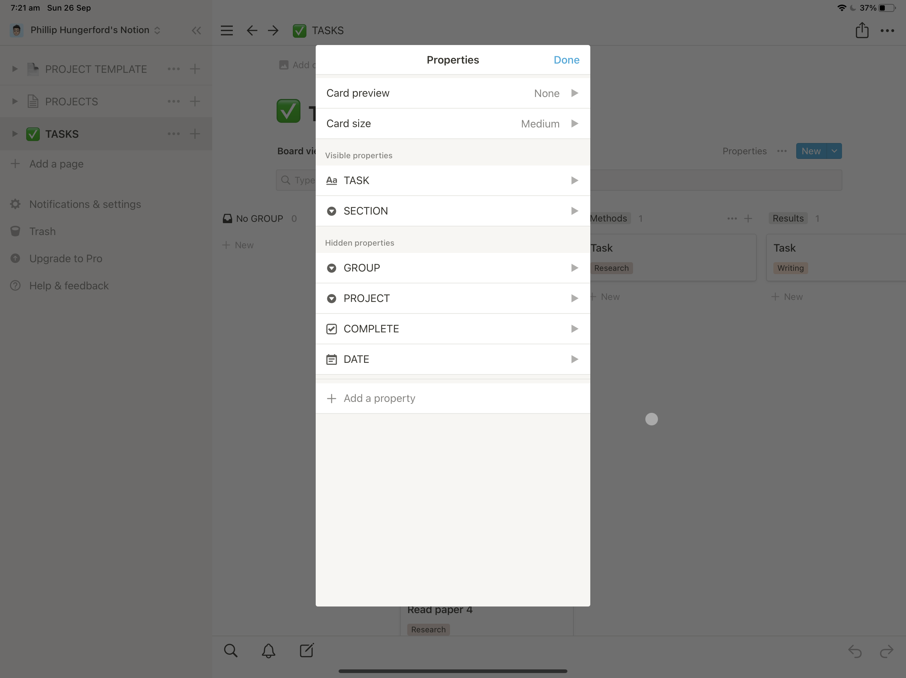

 

You can order these however you like. 

To help, view in table mode and duplicate the GROUP by the number of SECTIONS it has. Here I would have 4 copies of Introduction because there are 4 SECTIONS within it. 

Now if you view in board mode and count the cards, that is how many 30min chunks it will take to complete that GROUP. E.g. if you have 8 cards, that is 4 hours. 

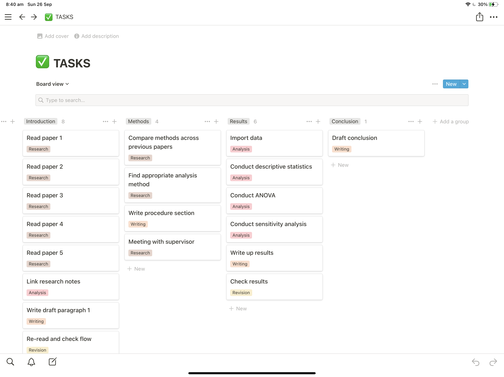

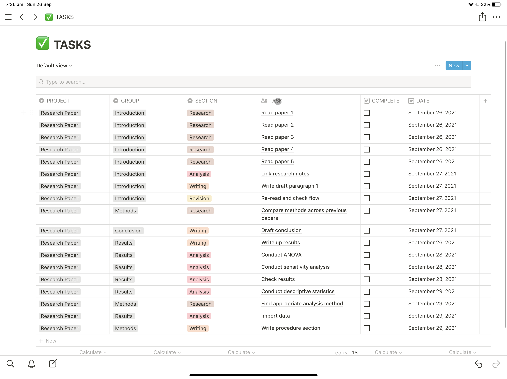

When you view it in calendar mode:

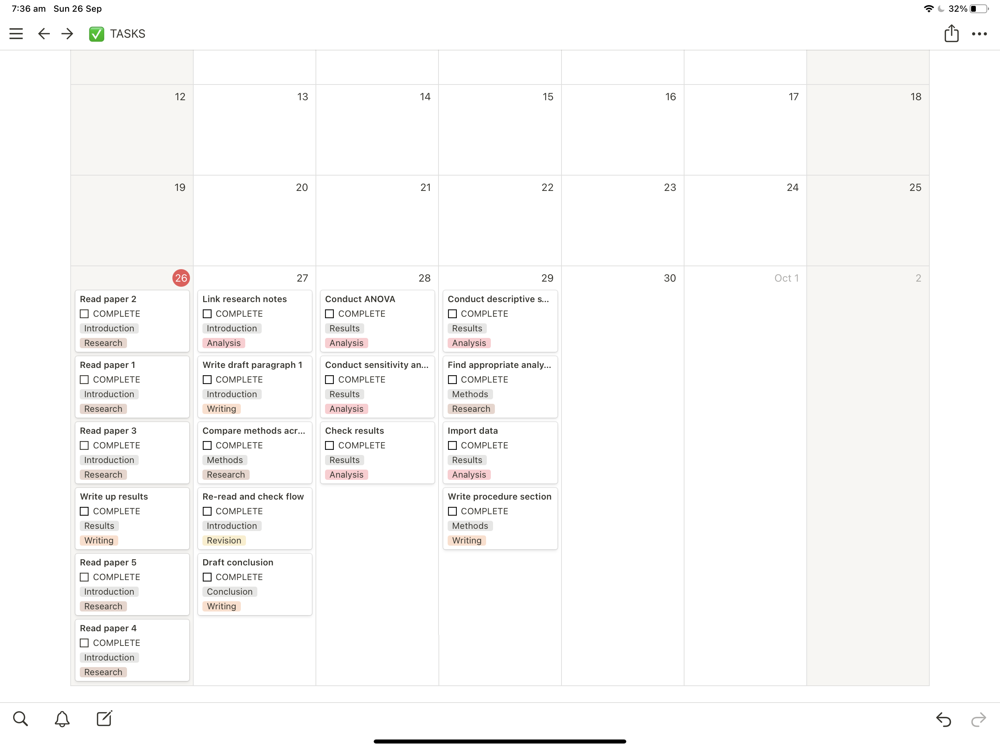

If you want to move something to another day, its easy, just grab the card and move it to another day.

If you want to put it all together, add a “TYPE” column that can be either a “TASK” or a “MEETING”. 

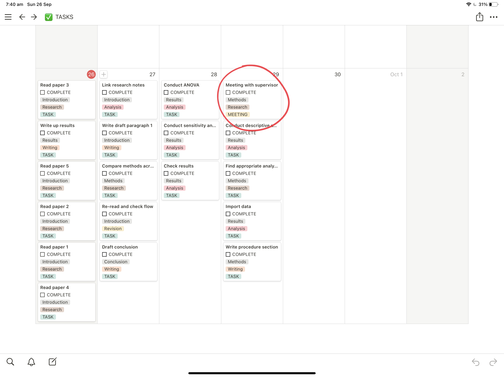

---
Return to the [home page](index.md).